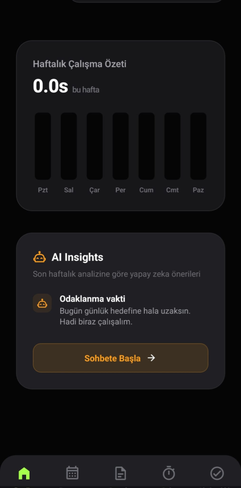
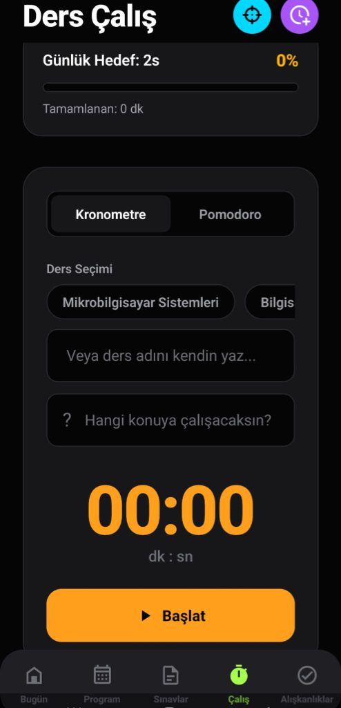
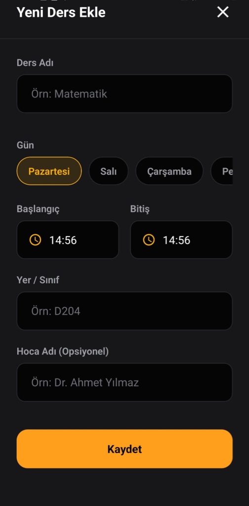

<p align="center">
  
</p>

<h1 align="center">StudyLife: Akıllı Akademik İşletim Sistemi</h1>

<p align="center">
  
  
  
  
</p>

<p align="center">
  <b>Yapay zeka içgörüleri, oyunlaştırılmış verimlilik ve veri odaklı karar destek mekanizmalarıyla öğrenci deneyimini yeniden tanımlıyoruz.</b>
</p>

---

## 🚀 Genel Bakış

**StudyLife**, sıradan bir görev yöneticisinden çok daha fazlasıdır; modern öğrenciler için tasarlanmış kapsamlı bir **Akademik Karar Destek Sistemi**dir. Karmaşık ders programları ile yüksek performanslı akademik hedefler arasındaki boşluğu, tescilli bir AI koçluk motoru ve premium, dikkat dağıtmayan bir kullanıcı deneyimi ile doldurur.

## 🧠 Temel Mühendislik Özellikleri

### 1. Yapay Zeka Karar Destek Motoru (DSE)
StudyLife'ın kalbinde gelişmiş bir AI mantık katmanı bulunur. Statik uygulamaların aksine StudyLife, kullanıcı davranışlarını analiz ederek şunları sunar:
- **Dinamik Risk Değerlendirmesi:** Devamsızlık ve sınav hazırlık durumunu takip ederek, olası akademik riskleri oluşmadan önce tespit eder ve kullanıcıyı uyarır.
- **Bağlamsal Koçluk:** Sadece sohbet etmekle kalmayan, kullanıcının yorgunluk seviyesine ve teslim tarihlerine göre spesifik çalışma teknikleri (Pomodoro, Aktif Hatırlatma vb.) öneren akıllı asistan.

### 2. Oyunlaştırılmış Davranış Döngüleri
Alışkanlık oluşumunun psikolojik prensipleri üzerine inşa edilmiştir:
- **Tutarlılık Puanlaması:** Süreklilik arz eden öğrenme davranışlarını ödüllendiren haftalık bir skorlama algoritması.
- **Akademik Liderlik Tabloları:** Rekabetçi akademik takibi teşvik eden sosyal etkileşim katmanı.

### 3. Yüksek Performanslı UI/UX Tasarımı
- **Glassmorphic Arayüz:** Odaklanmayı artıran ve estetik bir zevk sunan premium karanlık tema.
- **Mikro Etkileşimler:** React Native'in temel animasyon prensipleri kullanılarak optimize edilmiş pürüzsüz geçişler.

## 🛠 Teknoloji Yığını ve Mimari

- **Frontend:** React Native & Expo (Managed Workflow)
- **Durum Yönetimi (State):** Tema ve kullanıcı verileri için React Context API.
- **Veri Saklama:** `AsyncStorage` ile yüksek hızlı yerel veri yönetimi.
- **Mantık Katmanı:** Modüler Yardımcı Motorlar (AI Coach, Öncelik Motoru, Risk Analizörü).

### Klasör Yapısı
```bash
src/
 ├── components/     # Yeniden Kullanılabilir Atomik Bileşenler
 ├── screens/        # Özellik Bazlı Ekran Modülleri
 ├── utils/          # Çekirdek Mantık ve AI Motorları (Uygulamanın Beyni)
 ├── storage/        # Veri Kalıcılık Katmanı
 └── theme/          # Merkezi Tasarım Sistemi (Renkler, Fontlar)
```

## 📸 Görsel Yolculuk

<table style="width:100%">
  <tr>
    <td width="33%"></td>
    <td width="33%"></td>
    <td width="33%"></td>
  </tr>
  <tr align="center">
    <td><b>Akıllı Panel</b></td>
    <td><b>AI Study Buddy</b></td>
    <td><b>Haftalık Program</b></td>
  </tr>
  <tr>
    <td width="33%"></td>
    <td width="33%"></td>
    <td width="33%"></td>
  </tr>
  <tr align="center">
    <td><b>Analitik İçgörüler</b></td>
    <td><b>Odaklanma Sayacı</b></td>
    <td><b>Ders Yönetimi</b></td>
  </tr>
</table>

## 🏁 Başlangıç

### Gereksinimler
- Node.js (v18+)
- Mobil cihazınızda Expo Go uygulaması

### Kurulum
1. Repoyu klonlayın: `git clone https://github.com/nidaozbey/StudyLife.git`
2. Bağımlılıkları yükleyin: `npm install`
3. Başlatın: `npx expo start`

---
<p align="center">
  <b>Nida Özbey</b> tarafından geliştirilmiştir.<br/>
  <i>Bilgisayar Mühendisliği Öğrencisi</i>
</p>
