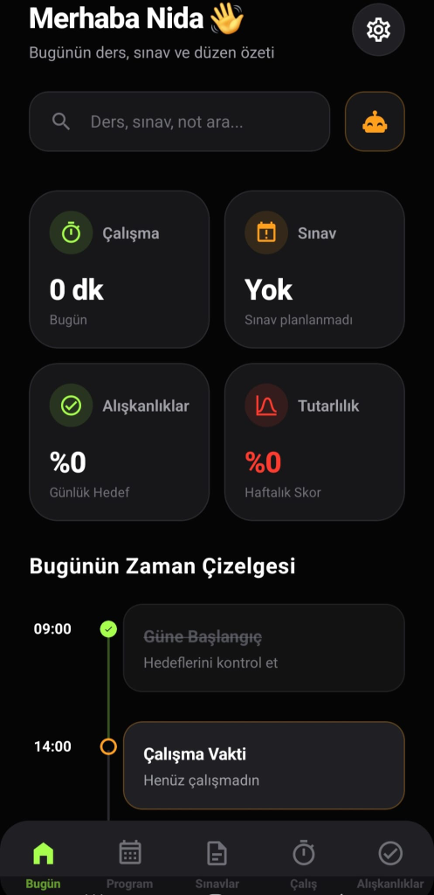
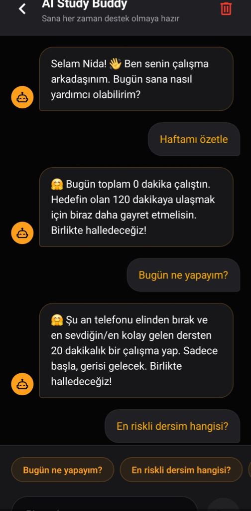
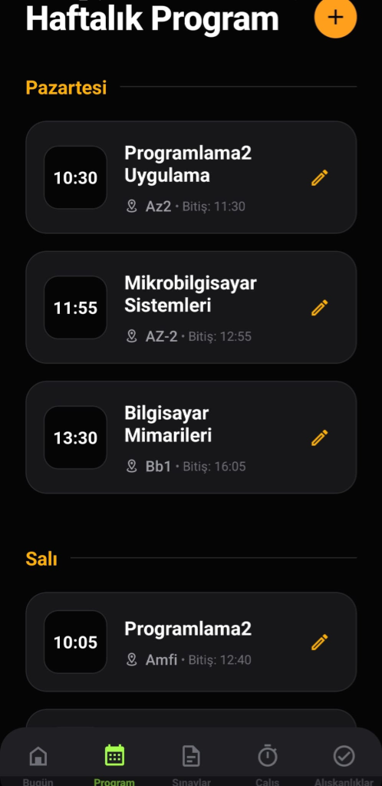

<p align="center">
  
</p>

<h1 align="center">StudyLife: Intelligent Academic Operating System</h1>

<p align="center">
  
  
  
  
</p>

<p align="center">
  <b>Empowering students through AI-driven insights, gamified productivity, and data-backed decision support.</b>
</p>

---

## 🚀 Overview

**StudyLife** is not just another task manager; it's a comprehensive **Academic Decision Support System**. Designed for the modern student, it bridges the gap between chaotic schedules and high-performance academic goals using a proprietary AI coaching engine and a premium, distraction-free user experience.

## 🧠 Core Engineering Features

### 1. AI Decision Support Engine (DSE)
The heart of StudyLife is its AI logic layer. Unlike static apps, StudyLife analyzes student behavior to provide:
- **Dynamic Risk Assessment:** Tracks attendance and exam readiness to alert students of potential failure points before they happen.
- **Contextual Coaching:** A conversational AI buddy that doesn't just chat, but suggests specific study techniques (Pomodoro, Active Recall) based on the user's current fatigue and deadlines.

### 2. Gamified Behavioral Loops
Built on psychological principles of habit formation:
- **Consistency Scoring:** A weekly scoring algorithm that rewards streak-based learning.
- **Social Leaderboards:** Competitive academic tracking to foster community-driven excellence.

### 3. High-Performance UI/UX
- **Glassmorphic Design:** A premium dark-themed interface built for focus and aesthetic pleasure.
- **Micro-Interactions:** Smooth transitions and feedback loops implemented using React Native's core animation principles.

## 🛠 Tech Stack & Architecture

- **Frontend:** React Native with Expo (Managed Workflow)
- **State Management:** React Context API for theme and user global state.
- **Persistence:** High-speed local data management via `AsyncStorage`.
- **Logic:** Modular Utility Engines (AI Coach, Priority Engine, Risk Analyzer).

### Directory Structure
```bash
src/
 ├── components/     # Reusable Atomic UI Components
 ├── screens/        # Feature-based Screen Modules
 ├── utils/          # Core Logic & AI Engines (The "Brain")
 ├── storage/        # Data Persistence Layer
 └── theme/          # Centralized Design System (Tokens, Colors)
```

## 📸 Visual Journey

<table style="width:100%">
  <tr>
    <td width="33%"></td>
    <td width="33%"></td>
    <td width="33%"></td>
  </tr>
  <tr align="center">
    <td><b>Intelligent Dashboard</b></td>
    <td><b>AI Study Buddy</b></td>
    <td><b>Dynamic Program</b></td>
  </tr>
</table>

## 🏁 Getting Started

### Prerequisites
- Node.js (v18+)
- Expo Go on your mobile device

### Installation
1. Clone the repo: `git clone https://github.com/nidaozbey/StudyLife.git`
2. Install dependencies: `npm install`
3. Launch: `npx expo start`

---
<p align="center">
  Developed by <b>Nida Özbey</b><br/>
  <i>Software Engineering Student & Product Developer</i>
</p>
